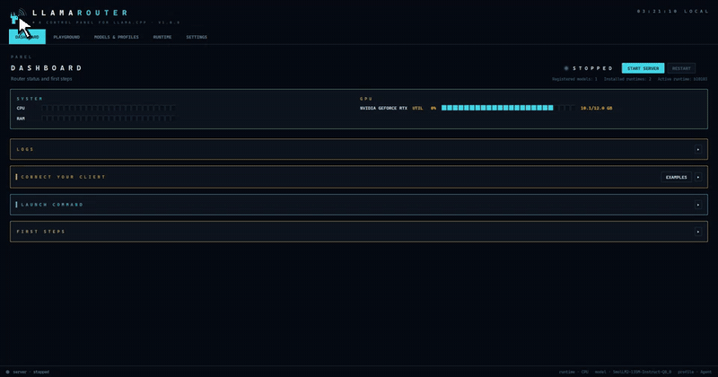

# Llama Router

<p align="center">
  
</p>

<p align="center">
  
</p>

<p align="center">
  <strong>A desktop control panel for <a href="https://github.com/ggerganov/llama.cpp">llama.cpp</a> servers.</strong><br>
  Manage local GGUF models with a native Python + Tkinter application.
</p>

## What you can do

- **Install runtimes**, download prebuilt `llama-server` binaries (CUDA, Vulkan, CPU) or import one you already compiled.
- **Find your models**, point it at folders with `.gguf` files and scan.
- **Configure routes**, per-model context, GPU layers, sampling, speculative decoding, and server parameters in one workspace.
- **Generate `models-preset.ini`**, stays in sync with your routes, consumed directly by `llama-server`.
- **Run the server**, start, stop, restart from the Dashboard with live logs and health checks.
- **Watch the GPU**, VRAM and utilization while the server is up.
- **Use the built-in playground**, chat with a running model, stream responses, attach files, copy code blocks, and retain local sessions.

## Demo

[](llama_router/assets/screenshots/app_demo.mp4)

Start the server, connect a client, chat in the Playground, inspect models and
runtimes, then switch themes. Click the demo for the higher-quality MP4.

## Quick start

Launch the application:

```bat
:: Windows
launch.bat
```

```bash
# Linux / macOS
./launch.sh
```

Or invoke it directly with `py -3 main.py` on Windows or `python3 main.py` elsewhere. Then:

1. Open **Runtime**, choose a prebuilt build appropriate for your hardware, and click **Install**. You can instead import an existing `llama-server` build.
2. Open **Models & Profiles**, add folders containing `.gguf` files, and click **Scan**.
3. Enable a model and configure its route: context size, GPU layers, sampling, speculative decoding, and other `llama-server` options.
4. Open **Dashboard** and click **Start Server**.
5. Connect an OpenAI-compatible client to `http://127.0.0.1:8080/v1`.

The app regenerates `config/models-preset.ini` whenever the model registry, profiles, or global settings change. That file is passed to `llama-server` when it starts.

## Requirements

- **Python 3.10+** is the only application dependency. On Linux, Tk may be packaged separately: `sudo apt install python3-tk`.
- **Windows 10/11, Linux, or macOS.** Windows additionally supports notification-area controls and Job Object cleanup.

## Data and files

In source mode, Llama Router is portable: it creates these folders beside `main.py` on first launch.

| Path | Purpose |
| --- | --- |
| `config/` | SQLite configuration, API-key store, and generated `models-preset.ini` |
| `models/` | Default location for models (you may also scan other folders) |
| `runtime/` | Downloaded or imported `llama.cpp` runtimes |
| `logs/` | Application and server logs |

Frozen builds ask where to store data the first time they run. Choosing the app folder keeps the installation portable; choosing another writable folder stores a small pointer next to the executable.

## Troubleshooting

- **Tkinter is missing on Linux:** install `python3-tk`, then run `python3 main.py` again.
- **The server will not start:** check that a runtime is installed and active, at least one model is enabled, and the configured port is not in use. The Dashboard log explains startup failures.
- **A client cannot connect:** verify the Dashboard endpoint and use `/v1` for OpenAI-compatible clients. If an API key is enabled, provide it as a Bearer token.
- **GPU acceleration is unavailable:** install/select a runtime matching your hardware and drivers, or use the CPU runtime.
- **Another instance is already running:** only one application instance can use the same data folder. Close the existing instance before launching another.

## License

MIT
